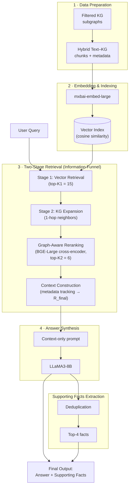

# Knowledge Graph Enhanced RAG (KG-RAG)

A precision-oriented Knowledge Graph–Enhanced Retrieval-Augmented Generation framework for multi-hop question answering. KG-RAG combines dense vector retrieval, knowledge-graph expansion, neural cross-encoder reranking, and supporting-fact deduplication in a staged **"Information Funnel"** pipeline, evaluated on the HotpotQA distractor benchmark.

> Mini Project (5th Semester, CSE), KLE Technological University, Hubballi — 2025–2026

## Overview

Traditional RAG systems struggle with multi-hop questions because relevant information is often spread across documents with no direct semantic overlap, and graph-based expansion tends to introduce noisy, irrelevant neighbors. This project addresses both problems with a multi-stage funnel:

1. **Broad vector retrieval** (top-15) — maximize recall
2. **Knowledge graph expansion** — pull in 1-hop related entities to bridge the "connectivity gap"
3. **Neural reranking** (BGE-Large cross-encoder) — score relational + semantic relevance
4. **Aggressive filtering** (top-6) — cut noise before generation
5. **Supporting-fact deduplication** (top-4) — remove redundant evidence
6. **Context-only answer generation** (LLaMA3-8B via Ollama) — answers are grounded strictly in retrieved evidence

A quantifiable **selection pressure metric (ρ)** measures how aggressively the funnel filters candidates at each stage (ρ ≈ 0.82 in our experiments).

## Results (HotpotQA distractor set, 5,500 questions)

| Metric | Baseline RAG | KG-RAG | Change |
|---|---|---|---|
| Answer EM | 0.4676 | 0.4784 | +2.31% |
| Answer F1 | 0.6029 | 0.6085 | +0.93% |
| SP Precision | 0.2173 | 0.4052 | **+86.48%** |
| SP F1 | 0.3381 | 0.4991 | +47.61% |
| Joint Precision | 0.1439 | 0.2823 | **+96.18%** |
| Joint F1 | 0.2173 | 0.3357 | +54.50% |

Component ablation on SP Precision: KG expansion (+33.0%), reranking (+30.9% incremental), deduplication (+11.2% incremental).

Full methodology, formalization, and discussion are in [`paper/`](./paper) and [`report/`](./report).

## Repository structure

```
.
├── main-code.py          # End-to-end KG-RAG pipeline (retrieval → KG expansion → rerank → generation)
├── notebooks/            # Demo notebook
├── paper/                # Conference-style paper (PDF)
├── report/               # Full mini-project report (PDF)
├── requirements.txt      # Python dependencies
└── .gitignore
```

## Architecture

The system implements four sequential stages — Data Preparation, Two-Stage Retrieval, Graph-Aware Reranking, and Answer Synthesis — forming a precision-oriented "Information Funnel":



**Selection pressure ρ ≈ 0.82** — the funnel filters roughly 82% of candidates between initial retrieval+expansion (~55 candidates) and the final context (6 documents, top-4 supporting facts).

<details>
<summary>Prefer a static image instead of Mermaid?</summary>

Mermaid diagrams render automatically on GitHub — no extra setup needed. If you'd rather ship a PNG/SVG (e.g. for the paper or a slide), export this block with the [Mermaid Live Editor](https://mermaid.live) or `mmdc` (`@mermaid-js/mermaid-cli`) and drop it in a `docs/` or `assets/` folder, then embed it with ``.

</details>

## Getting started

### Prerequisites
- Python 3.10+
- [Ollama](https://ollama.ai) running locally, with the models pulled:
  ```bash
  ollama pull llama3:8b
  ollama pull mxbai-embed-large
  ```
- A local copy of the `bge-reranker-large` model (path passed via `--reranker`)

### Installation
```bash
git clone https://github.com/<your-username>/Knowledge-Graph-Enhanced-RAG.git
cd Knowledge-Graph-Enhanced-RAG
pip install -r requirements.txt
```

### Data
The pipeline expects:
- **HotpotQA** distractor dev set (`hotpot_dev_distractor_v1.json`)
- Pre-extracted per-entity knowledge subgraphs (JSON files keyed by entity name) in a `kg_dir`

Update the `--data_path` / `--kg_dir` defaults in `main-code.py`, or pass them as CLI args (see the commented-out `musique` / `trivia` argument blocks in the script for other supported datasets).

### Run
```bash
python main-code.py \
  --dataset hotpotqa \
  --data_path ../data/hotpotqa/hotpot_dev_distractor_v1.json \
  --kg_dir ../data/hotpotqa/kgs/extract_subkgs \
  --reranker ../../bge-reranker-large \
  --result_path ../output/hotpot/hotpot_dev_distractor_v1_kgrag_improved.json
```

Key hyperparameters:
| Flag | Default | Description |
|---|---|---|
| `--initial_top_k` | 15 | Initial vector retrieval depth |
| `--final_top_k` | 6 | Post-rerank filtering depth |
| `--max_supporting_facts` | 4 | Max supporting facts returned |

> Note: `main-code.py` currently processes only 5% of the loaded dataset by default (see `main()`) — adjust this if you want a full run.

## Team

| Name | USN |
|---|---|
| Sneha Chinchakandi | 01FE23BCS377 |
| Yashaswini S M | 01FE23BCS288 |
| Mahesh Khatwate | 01FE23BCS291 |
| Amogh Annigeri | 01FE23BCS210 |

**Guide:** Dr. Meena S M, School of Computer Science and Engineering, KLE Technological University, Hubballi

## Citation

If you use this work, please cite:

```bibtex
@misc{chinchakandi2025kgrag,
  title  = {Enhancing Retrieval-Augmented Generation via Knowledge Graphs},
  author = {Sneha Chinchakandi, Yashaswini Mellikeri, Mahesh Khatawate, Amogh Annigeri, Meena S M},
  year   = {2025},
  note   = {KLE Technological University}
}
```

## Future work
- Real-time / continuously updated knowledge graphs
- Adaptive (query-aware) hop-depth selection
- Domain-specific KGs (healthcare, law, finance)
- Reasoning-path visualization for explainability

## License

Add a license (e.g. MIT) if you intend this to be reused — see the note below.
